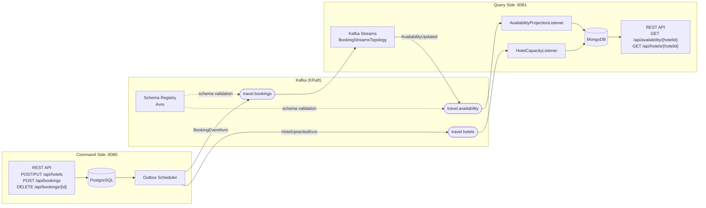

# Travel Agency - CQRS (Orchestration)

[](https://spring.io/projects/spring-boot)
[](https://openjdk.org/)
[](https://kafka.apache.org/)
[](https://www.postgresql.org/)
[](https://www.mongodb.com/)
[](https://www.docker.com/)
[](https://grafana.com/)
[](https://prometheus.io/)
[](https://opensource.org/licenses/MIT)

<a id="toc"></a>
## Table of Contents

- [Overview](#overview)
- [Related Repositories](#related-repositories)
- [Architecture](#architecture)
- [Getting Started](#getting-started)
- [Services & Ports](#services-and-ports)
- [Swagger UI](#swagger-ui)
- [Observability](#observability)
- [API Endpoints](#api-endpoints)
- [Kafka Topics](#kafka-topics)
- [Environment Variables](#environment-variables)
- [E2E Smoke Tests](#e2e-tests)
- [Project Structure](#project-structure)
- [Contact](#contact)

---

<a id="overview"></a>
## Overview

[↑ Back to top](#toc)

This is the **orchestration repository** for a CQRS-based hotel booking platform. It does not contain application source code - instead it provides a single `docker-compose.yml` that pulls pre-built images from Docker Hub and wires together the full infrastructure: databases, Kafka cluster, Schema Registry, and both microservices.

The system implements **Command Query Responsibility Segregation (CQRS)** with **Event-Driven Architecture**: the command side handles booking creation and cancellation (writes), publishes domain events to Kafka via the Transactional Outbox Pattern, and the query side consumes those events through Kafka Streams to build a denormalized availability read model in MongoDB.

---

<a id="related-repositories"></a>
## Related Repositories

[↑ Back to top](#toc)

| Service | Description | Repository |
|---------|-------------|------------|
| **Command Side** | Write model - booking creation & cancellation, Transactional Outbox, Kafka producer | [Travel-Agency-Command-Side-CQRS](https://github.com/mrzodeczko-dev/Travel-Agency-Command-Side-CQRS-Write-Model-) |
| **Query Side** | Read model - Kafka Streams aggregation, MongoDB projections, availability REST API | [Travel-Agency-Query-Side-CQRS](https://github.com/mrzodeczko-dev/Travel-Agency-Query-Side-CQRS) |

---

<a id="architecture"></a>
## Architecture

[↑ Back to top](#toc)



**Data flow:**

1. Client creates hotels (`POST /api/hotels`) and bookings (`POST` / `DELETE /api/bookings`) on the Command Side
2. Command Side persists the entity in PostgreSQL and saves an outbox entry in the same transaction (Transactional Outbox Pattern)
3. Outbox Scheduler polls and publishes events to Kafka: `BookingEventAvro` → `travel.bookings`, `HotelUpsertedAvro` → `travel.hotels`
4. Query Side's Kafka Streams topology consumes booking events, computes per-hotel per-day occupancy deltas, and emits `AvailabilityUpdated` events to the `travel.availability` topic
5. Hotel Capacity Listener consumes `HotelUpserted` events and updates hotel capacity in MongoDB
6. Availability Projection Listener upserts the read model in MongoDB with current occupancy, capacity, and availability status (`AVAILABLE` / `LAST_ROOMS` / `SOLD_OUT`)
7. Client queries availability via the Query Side REST API, which reads directly from MongoDB

---

<a id="getting-started"></a>
## Getting Started

[↑ Back to top](#toc)

### Prerequisites

- Docker and Docker Compose v2+
- Application images available on Docker Hub:
  - `mrzodeczko/travel-agency-command-side`
  - `mrzodeczko/travel-agency-query-side`

### 1. Clone and configure

```bash
git clone https://github.com/mrzodeczko-dev/Travel-Agency-CQRS.git
cd Travel-Agency-CQRS
cp .env.example .env
```

Edit `.env` to set your own passwords if needed. The defaults are suitable for local development only.

### 2. Start the stack

```bash
docker compose up -d --build
```

All services start in dependency order via healthchecks - databases and Kafka must be healthy before the applications launch. The `kafka-init` container creates the required topics and exits.

### 3. Verify

```bash
# Command Side health
curl http://localhost:8080/actuator/health

# Query Side health
curl http://localhost:8081/actuator/health
```

### 4. Stop

```bash
docker compose down          # stop containers, keep volumes
docker compose down -v       # stop containers, remove volumes (clean state)
```

---

<a id="services-and-ports"></a>
## Services & Ports

[↑ Back to top](#toc)

| Service | Container | Port | Description |
|---------|-----------|------|-------------|
| Command Side API | `travel-agency-command-side` | `8080` | Booking creation and cancellation |
| Query Side API | `travel-agency-query-side` | `8081` | Availability queries |
| PostgreSQL | `travel-agency-command-side-postgres` | `5432` | Command side database |
| MongoDB | `mongodb` | `27017` | Query side read model |
| Kafka Broker | `kafka-single` | `9092` | Event streaming (KRaft mode) |
| Schema Registry | `schema-registry` | `8200` | Avro schema management |
| Kafka UI | `kafka-ui` | `8100` | Web interface for Kafka monitoring |
| Liquibase (MongoDB) | `liquibase-mongo` | - | Runs MongoDB migrations and exits |
| Kafka Init | `kafka-init` | - | Creates Kafka topics and exits |
| Prometheus | `prometheus` | `9090` | Metrics collection and storage |
| Grafana | `grafana` | `3000` | Dashboards and observability UI |

---

<a id="swagger-ui"></a>
## Swagger UI

[↑ Back to top](#toc)

Both services expose interactive API documentation via springdoc-openapi. Swagger UI is controlled by the `SPRINGDOC_ENABLED` variable in the `.env` file (created from `.env.example`). Set it to `true` to enable:

```properties
SPRINGDOC_ENABLED=true
```

| Service | URL |
|---------|-----|
| Command Side | [http://localhost:8080/swagger-ui.html](http://localhost:8080/swagger-ui.html) |
| Query Side | [http://localhost:8081/swagger-ui.html](http://localhost:8081/swagger-ui.html) |

---

<a id="observability"></a>
## Observability

[↑ Back to top](#toc)

The stack includes **Prometheus** for metrics scraping and **Grafana** for dashboards and visualization.

Grafana starts with anonymous access enabled (Viewer role) - no login required to browse dashboards. Admin credentials: `admin` / `admin`.

### Grafana Dashboards

All dashboards are provisioned automatically from `observability/grafana/dashboards/` and are available at [http://localhost:3000](http://localhost:3000).

#### Command Side

| Dashboard | URL | Description |
|-----------|-----|-------------|
| Application Overview | [localhost:3000/d/application-overview-command-side](http://localhost:3000/d/application-overview-command-side) | JVM metrics, HTTP throughput, error rates |
| Booking Service | [localhost:3000/d/booking-service](http://localhost:3000/d/booking-service) | Booking creation and cancellation metrics |
| Hotels Service | [localhost:3000/d/hotels-service](http://localhost:3000/d/hotels-service) | Hotel CRUD operation metrics |
| Kafka Producer | [localhost:3000/d/kafka-producer](http://localhost:3000/d/kafka-producer) | Outbox publish rates, producer latency |
| Request Stats | [localhost:3000/d/requests-stats-command-side](http://localhost:3000/d/requests-stats-command-side) | HTTP request latencies, status codes |

#### Query Side

| Dashboard | URL | Description |
|-----------|-----|-------------|
| Application Overview | [localhost:3000/d/application-overview-query-side](http://localhost:3000/d/application-overview-query-side) | JVM metrics, HTTP throughput, error rates |
| Kafka Messaging | [localhost:3000/d/kafka-messaging-query-side](http://localhost:3000/d/kafka-messaging-query-side) | Consumer lag, Kafka Streams processing rates |
| Request Stats | [localhost:3000/d/requests-stats-query-side](http://localhost:3000/d/requests-stats-query-side) | HTTP request latencies, status codes |

### Other UIs

- **Prometheus**: [http://localhost:9090](http://localhost:9090) - raw metrics, PromQL queries

---

<a id="api-endpoints"></a>
## API Endpoints

[↑ Back to top](#toc)

### Command Side (`:8080`)

| Method | Path | Description | Request Body | Success | Errors |
|--------|------|-------------|--------------|---------|--------|
| `POST` | `/api/hotels` | Create a hotel | `{ capacity }` | `201 Created` | `400` |
| `PUT` | `/api/hotels/{id}` | Update hotel capacity | `{ capacity }` | `200 OK` | `400` |
| `POST` | `/api/bookings` | Create a booking | `{ hotelId, userId, start, end }` | `201 Created` | `400`, `409` |
| `DELETE` | `/api/bookings/{id}` | Cancel a booking | - | `204 No Content` | `404`, `409` |

### Query Side (`:8081`)

| Method | Path | Description | Query Params | Success | Errors |
|--------|------|-------------|--------------|---------|--------|
| `GET` | `/api/availability/{hotelId}` | Get hotel availability | `from`, `to` (ISO dates, optional) | `200 OK` | `400` |
| `GET` | `/api/hotels/{hotelId}` | Get hotel capacity | - | `200 OK` | `404` |

### cURL examples

```bash
# Create a hotel
curl -X POST http://localhost:8080/api/hotels \
  -H "Content-Type: application/json" \
  -d '{"capacity": 100}'

# Create a booking
curl -X POST http://localhost:8080/api/bookings \
  -H "Content-Type: application/json" \
  -d '{"hotelId": 1, "userId": 1, "start": "2026-08-01", "end": "2026-08-07"}'

# Check availability
curl "http://localhost:8081/api/availability/1?from=2026-08-01&to=2026-08-07"

# Cancel a booking
curl -X DELETE http://localhost:8080/api/bookings/1
```

---

<a id="kafka-topics"></a>
## Kafka Topics

[↑ Back to top](#toc)

All topics are created automatically by the `kafka-init` container on startup.

| Topic | Schema | Description |
|-------|--------|-------------|
| `travel.bookings` | `BookingEventAvro` | Booking events with `EventType` enum (`BookingCreated` / `BookingCancelled`) |
| `travel.availability` | `AvailabilityUpdated` | Aggregated per-hotel per-day occupancy (output of Kafka Streams) |
| `travel.hotels` | `HotelUpserted` | Hotel capacity changes (`cleanup.policy=compact`) |

---

<a id="environment-variables"></a>
## Environment Variables

[↑ Back to top](#toc)

Copy `.env.example` to `.env` and adjust as needed. All variables are documented in the example file.

### PostgreSQL (Command Side)

| Variable | Description | Default |
|----------|-------------|---------|
| `TA_COMMAND_SIDE_SERVICE_DB_PORT` | Host port for PostgreSQL | `5432` |
| `TA_COMMAND_SIDE_SERVICE_DB_NAME` | Database name | `travels_db` |
| `TA_COMMAND_SIDE_SERVICE_DB_USER` | DB user | `user` |
| `TA_COMMAND_SIDE_SERVICE_DB_PASSWORD` | DB password | `changeme` |

### MongoDB (Query Side)

| Variable | Description | Default |
|----------|-------------|---------|
| `MONGO_PORT` | Host port for MongoDB | `27017` |
| `MONGO_DB_NAME` | Database name | `travels_read_db` |
| `MONGO_USER` | DB user | `user` |
| `MONGO_PASSWORD` | DB password | `changeme` |

### Applications

| Variable | Description | Default |
|----------|-------------|---------|
| `TA_COMMAND_SIDE_SERVICE_PORT` | Command Side HTTP port | `8080` |
| `QUERY_SIDE_SERVICE_PORT` | Query Side HTTP port | `8081` |
| `QUERY_SIDE_DEFAULT_HOTEL_CAPACITY` | Fallback hotel capacity | `100` |
| `QUERY_SIDE_LAST_ROOMS_THRESHOLD` | Fraction triggering `LAST_ROOMS` status | `0.9` |

### Kafka

| Variable | Description | Default |
|----------|-------------|---------|
| `CLUSTER_ID` | KRaft cluster ID | `MkU3OEVBNTcwNTJENDM2Qk` |
| `TOPIC_BOOKINGS` | Bookings topic name | `travel.bookings` |
| `TOPIC_AVAILABILITY` | Availability topic name | `travel.availability` |
| `TOPIC_HOTELS` | Hotels topic name | `travel.hotels` |
| `TOPIC_PARTITIONS` | Default partition count | `3` |
| `TOPIC_REPLICAS` | Replication factor | `1` |

---

<a id="e2e-tests"></a>
## E2E Smoke Tests

[↑ Back to top](#toc)

The `e2e/` directory is a standalone Maven project with JUnit 5 + RestAssured + Awaitility tests that run against the live stack. They verify the full CQRS pipeline end-to-end - no application source code needed.

Test data is managed automatically: `HotelSeeder` creates hotels via the command side REST API (`POST /api/hotels`) and waits for them to propagate to the query side, exercising the full CQRS pipeline.

### What is tested

| Test class | Scenarios |
|------------|-----------|
| `HealthCheckTest` | Both services respond `200` on `/actuator/health` |
| `BookingFlowTest` | Hotel seeding via API, create booking (`201`), availability projection appears on query side, cancel (`204`), double cancel (`409`), occupancy decreases after cancellation, input validation (`400`, `404`), paged response shape, database cleanup |

Availability assertions use Awaitility polling with a configurable timeout (default 120 s) to account for the asynchronous Kafka event pipeline with exactly-once semantics.

### Running the tests

```bash
# 1. Start the full stack
docker compose up -d

# 2. Run tests
cd e2e
mvn test
```

### Configuration

| Environment Variable | System Property | Description | Default |
|---------------------|-----------------|-------------|---------|
| `COMMAND_SIDE_URL` | `command.side.url` | Base URL of the command side | `http://localhost:8080` |
| `QUERY_SIDE_URL` | `query.side.url` | Base URL of the query side | `http://localhost:8081` |
| `E2E_PROPAGATION_TIMEOUT` | `e2e.propagation.timeout` | Max seconds to wait for event propagation | `120` |

```bash
# Example: custom URLs
mvn test -Dcommand.side.url=http://myhost:8080 -Dquery.side.url=http://myhost:8081
```

---

<a id="project-structure"></a>
## Project Structure

[↑ Back to top](#toc)

```
Travel-Agency-CQRS/
├── docker-compose.yml                                  # Full stack orchestration
├── .env.example                                        # Environment template (safe to commit)
├── .gitignore
├── query-side-liquibase-mongo/                         # MongoDB migrations for the Query Side
│   ├── Dockerfile-liquibase
│   ├── liquibase-deps.pom.xml
│   └── changelog/
│       ├── master.yaml
│       └── changes/
│           ├── 001-availability-hotelId-date-compound-index.yaml
│           ├── 002-availability-hotelId-index.yaml
│           └── 003-hotels-capacity-index.yaml
├── observability/                                      # Monitoring & tracing configuration
│   ├── grafana/
│   │   ├── dashboards/
│   │   │   ├── command-side/
│   │   │   │   ├── application-overview.json
│   │   │   │   ├── booking-service.json
│   │   │   │   ├── hotels-service.json
│   │   │   │   ├── kafka-producer.json
│   │   │   │   └── requests-stats.json
│   │   │   └── query-side/
│   │   │       ├── application-overview.json
│   │   │       ├── kafka-messaging.json
│   │   │       └── request-stats.json
│   │   └── provisioning/
│   │       ├── dashboards/dashboards.yml
│   │       └── datasources/datasources.yml
│   ├── prometheus/prometheus.yml
│   └── tempo/tempo.yml
├── e2e/                                                # E2E smoke tests (Java / JUnit 5)
│   ├── pom.xml                                         # Standalone Maven project
│   └── src/test/java/com/rzodeczko/e2e/
│       ├── E2EConfig.java                              # Shared configuration
│       ├── HotelSeeder.java                            # Seeds hotels via REST API (full CQRS flow)
│       ├── HealthCheckTest.java                        # Health check tests
│       └── BookingFlowTest.java                        # Full CQRS flow tests
├── LICENSE
└── README.md
```

---

<a id="contact"></a>
## Contact

[↑ Back to top](#toc)

Designed and implemented by **Michał Rzodeczko**.  
Other projects: [github.com/mrzodeczko-dev](https://github.com/mrzodeczko-dev)
